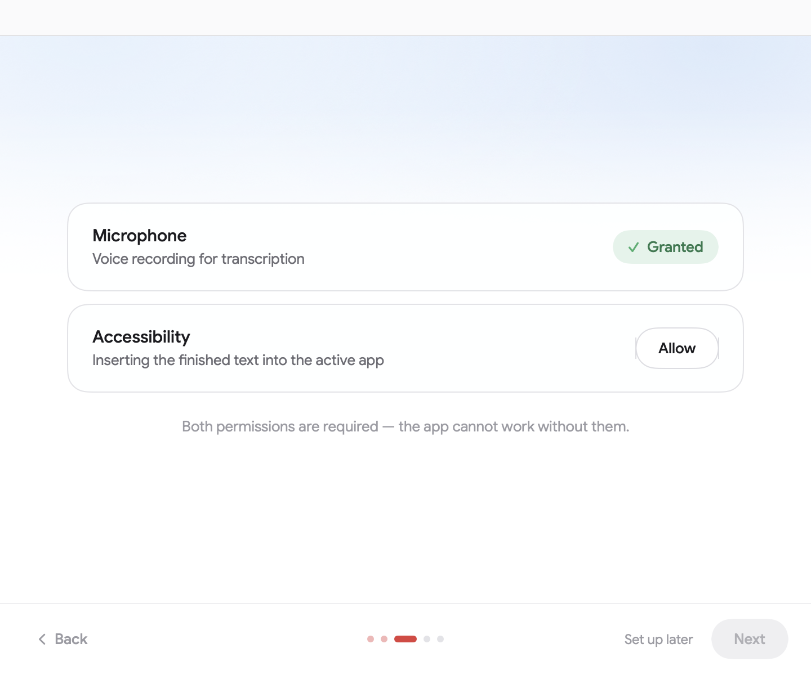
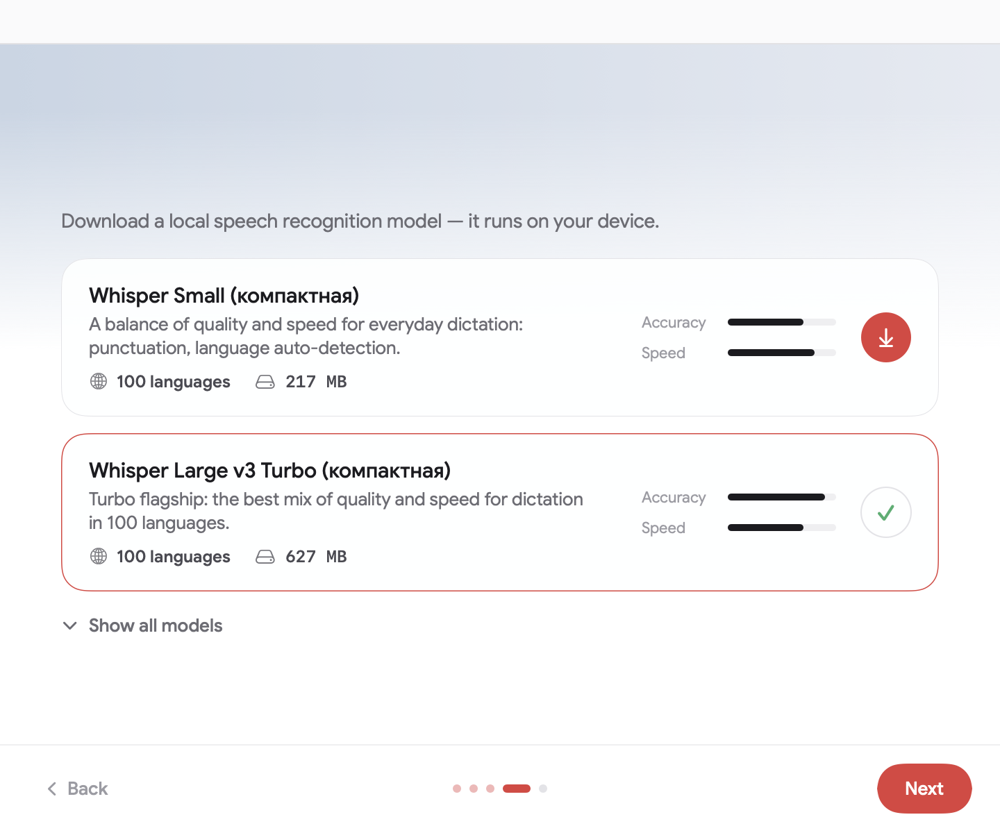
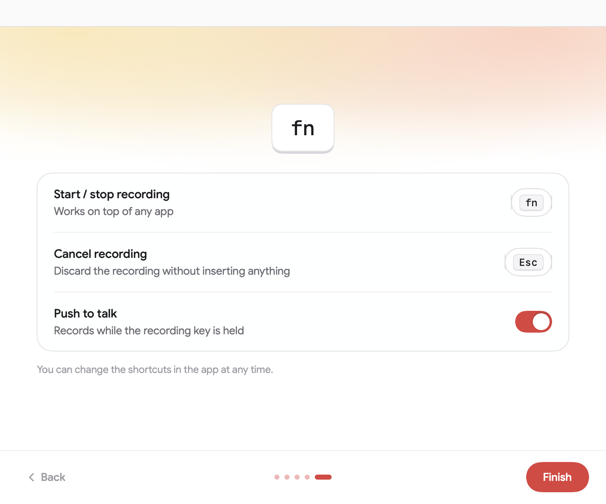

# v0ca.

**Локальная диктовка для macOS.** Нажми комбинацию — говори — текст появляется в активном приложении. Всё распознавание работает на твоём Mac: ни одного байта аудио не покидает устройство.

- ⌥ Space (или просто **fn**) → HUD-капсула записи → текст вставлен
- Локальные ASR-модели: WhisperKit (Whisper / CoreML) и FluidAudio (Parakeet, Neural Engine)
- Каталог из 20+ моделей: от мгновенной Tiny до флагманской Large v3
- Светлая и тёмная темы, 7 акцентных цветов, интерфейс на русском и английском
- История записей с воспроизведением и статистика диктовки
- Push-to-talk, автоперевод речи на английский, кастомные шорткаты

Полностью офлайн. Без подписок и лимитов.

## Первый запуск

Три шага до первой диктовки — разрешения, модель, комбинация:

| | |
|---|---|
|  |  |
|  |  |
|  |  |
|  |  |

## Сборка

Проект генерируется [XcodeGen](https://github.com/yonaskolb/XcodeGen):

```sh
xcodegen generate
open v0ca.xcodeproj
```

Требуется macOS 14+. Машинно-специфичные настройки подписи — в `Config/Local.xcconfig` (не в гите).

## Документация

- [`docs/PLAN.md`](docs/PLAN.md) — этапы разработки
- [`docs/ARCHITECTURE.md`](docs/ARCHITECTURE.md) — модули и протокол `TranscriptionEngine`
- [`docs/DESIGN.md`](docs/DESIGN.md) — токены дизайн-системы
- [`docs/MODELS.md`](docs/MODELS.md) — каталог моделей
