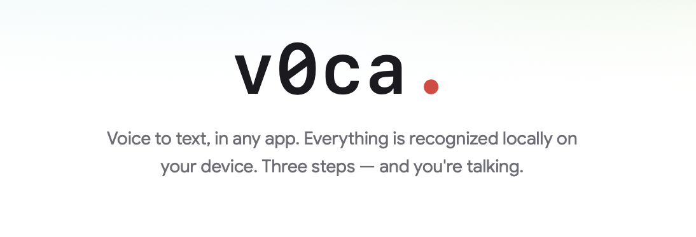
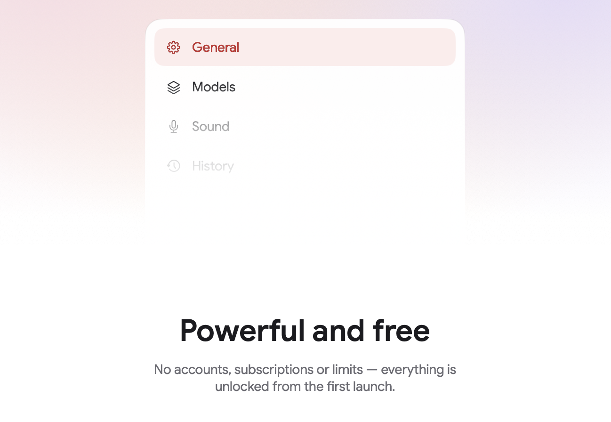
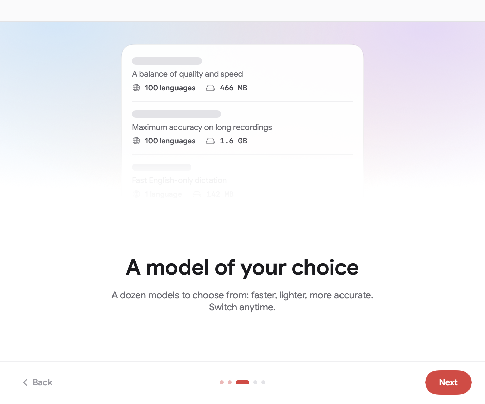
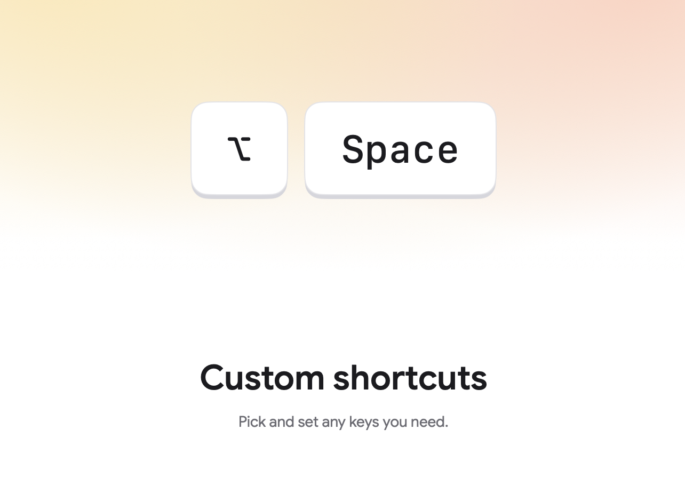
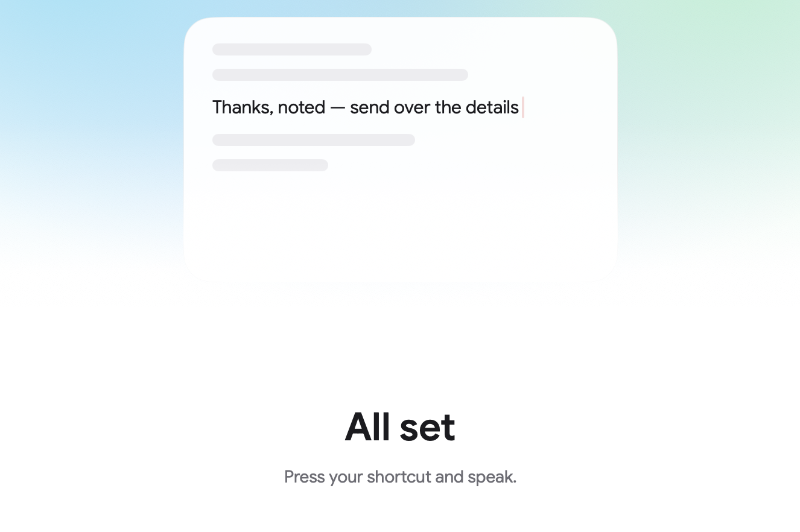

# v0ca.



**Local voice dictation for macOS.** Press a shortcut — speak — the text lands in whatever app you're typing in. All speech recognition runs on your Mac: not a single byte of audio ever leaves the device.

No accounts, no subscriptions, no limits. Fully offline, open source.

## Installation

Requires **macOS 14+**. The project is generated with [XcodeGen](https://github.com/yonaskolb/XcodeGen):

```sh
git clone <repo-url>
cd v0ca
xcodegen generate
open v0ca.xcodeproj
```

Code signing is machine-specific: copy `Config/Local.xcconfig.example` to `Config/Local.xcconfig` and put your `DEVELOPMENT_TEAM` there (kept out of git). Without signing the app builds fine, but macOS resets the microphone and Accessibility permissions on every rebuild.

## What's inside



v0ca is a menu-bar app. Press the recording shortcut anywhere, dictate into the HUD capsule, and the transcript is inserted into the active application via keyboard events — it works in any text field of any app.

- **Dictation** — lifetime stats (words transcribed, day streak, daily average) and today's recordings
- **General** — recognition language, auto-translate to English, insertion method, clipboard handling, HUD position
- **Models** — searchable catalog of local ASR models with one-click downloads
- **Sound** — input device picker with a live level meter, start/finish sounds
- **History** — recordings grouped by day with instant playback, copy and re-transcribe
- **Permissions** — microphone and Accessibility status at a glance

A first-launch onboarding walks you through permissions, model download and shortcut setup — dictation unlocks the moment you hit Done.

## Models



Two engines behind one `TranscriptionEngine` protocol:

- **WhisperKit** (CoreML) — the full Whisper family: Tiny, Base, Small, Medium, Large v3, Large v3 Turbo and Distil-Whisper, including compact quantized variants. Up to 100 languages, optional speech-to-English translation.
- **FluidAudio** (Parakeet TDT v2/v3) — ultra-fast transcription on the Neural Engine; v3 covers 25 European languages.

Every model card shows language coverage, size on disk and accuracy/speed bars. Downloaded models switch with one click; the active model can be unloaded from memory after a configurable idle timeout and is warmed up ahead of your first dictation. Cancel and resume downloads at any point — files stay on disk.

## Shortcuts



- **Start / stop recording** — any combination you like, default ⌥ Space
- **Plain `fn` key** as the trigger — captured via a CGEventTap, something regular hotkey APIs can't do
- **Push-to-talk** — hold the key to record, release to transcribe and insert
- **Esc** cancels an in-flight recording without inserting anything

Shortcuts are editable during onboarding and later in Settings, with a live key-cap preview.

## Appearance



- **Themes** — light, dark, or follow the system, switched live without a restart
- **Accent colors** — seven to choose from; hover, active and pastel shades are generated from the base color and adapt to both themes
- **Languages** — English and Russian UI, picked from the system language on first launch
- Design tokens end to end: every color in the app is a semantic token with a light/dark pair

## Credits

- [WhisperKit](https://github.com/argmaxinc/WhisperKit) — CoreML Whisper inference
- [FluidAudio](https://github.com/FluidInference/FluidAudio) — Parakeet models on the Neural Engine
- [KeyboardShortcuts](https://github.com/sindresorhus/KeyboardShortcuts) — global hotkey recording
- Fonts: [Google Sans](https://fonts.google.com/specimen/Google+Sans) (UI) and [Atkinson Hyperlegible Mono](https://fonts.google.com/specimen/Atkinson+Hyperlegible+Mono) (logo), both bundled under the [SIL Open Font License](https://openfontlicense.org) — license texts ship in `v0ca/Resources/Fonts/`

Developer docs live in [`docs/`](docs/): [architecture](docs/ARCHITECTURE.md), [design tokens](docs/DESIGN.md), [model catalog](docs/MODELS.md), [roadmap](docs/PLAN.md).

## License

Released under the [MIT License](LICENSE).
